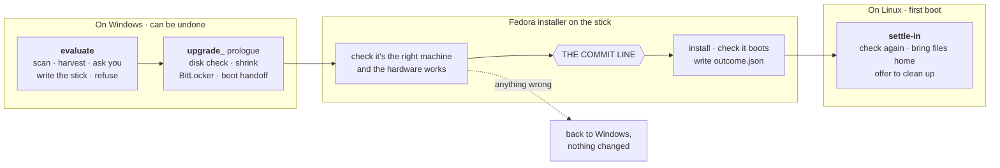
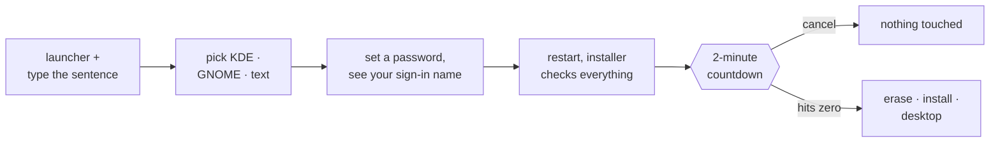

<div align="center">

# upgrade_

### Move your computer to Linux. One stick, one click, done.

Plug in a USB stick, pick a desktop, hit convert, and walk away. When you
come back it's a working Linux machine, with your files, Wi-Fi and browsers
still there. By default Windows doesn't get deleted either. It gets shrunk
and set to one side until you're sure you don't need it.

[](LICENSE)


[Why](#why) · [How it works](#how-it-works) · [Where it stands](#where-it-stands) ·
[The scanner](#the-scanner-evaluate) · [First principle](#first-principle) ·
[Roadmap](#roadmap) · [Contributing](#contributing)

</div>

> [!IMPORTANT]
> **Status (2026-09-26): not ready for your machine yet.** Every step of
> the conversion is written and has run start to finish on the test rig. One
> real laptop has now been erased and reinstalled with nobody touching it.
> It woke up to a text login instead of a desktop, so that counts as a fail.
> The cause is fixed and the rig passes again. What's left is doing it for
> real once more. Other gaps: only one brand of laptop tested so far,
> `settle-in` (the first boot on Linux) isn't built, and nothing is signed.
> Every claim below links to the test results, failures included.

---

## Why

Your hardware should be yours to customize.

Windows 10 stopped getting security updates in October 2025. Tons of
perfectly good machines can't run Windows 11, but they run Linux just fine.
The machine was never the problem. The problem is knowing how: which
version of Linux, which BIOS setting, which driver is missing, and how to
not lose your photos on the way.

**This project knows all that so you don't have to.**

## How it works

There are three parts. They're split by one question: can this step still
be undone?



| Part | Runs on | What it does |
|---|---|---|
| **`evaluate`** | Windows, read-only | Looks the machine over and asks what you want. Grabs the stuff only Windows knows (where your folders are, the BitLocker key and so on), writes the stick, and says no to anything it can't do safely. |
| **`upgrade_`** | Windows → Linux | Does the actual move. Normally it shrinks Windows and puts Linux next to it. It only erases the disk if you ask it to. |
| **`settle-in`** | Linux | Makes sure the hardware works, copies your files over from the old Windows side, then gets out of your way. |

> [!NOTE]
> **Right now it only works from Windows.** Nothing about the idea (look,
> commit, settle in) needs Windows, but all the code today reads a Windows
> machine: PowerShell, `bcdedit`, BitLocker, `netsh`. Other systems may be supported in the future.

### The commit line

Every conversion has exactly one point of no return. Windows stays bootable
right up until then.

| Path | The point of no return | What protects you |
|---|---|---|
| **Keep Windows** (the default) | **Clean-up.** Once Linux is working and your files are confirmed, you choose to delete the old Windows part. Until you do, Windows is one pick away in the boot menu. | You decide, after Linux is already running |
| **Erase and install** | **The wipe.** The installer shows a **2-minute countdown** you can cancel. Until it hits zero, nothing on your disks has changed. | Its own launcher, a sentence you type out, and hardware checks that have to pass first |

That leads to two rules:

1. The screen says *"you can still cancel"* right up to that moment, and
   stops saying it the second it's crossed.
2. **Anything that might say no has to say it before the line.** After it,
   the only way back is a slow recovery, from a drive that might be the
   thing that's failing.

The full design is in [docs/architecture.md](docs/architecture.md).

---

## Where it stands

Think of each bar as how far along the road a step has got:

```text
[####]  worked on a real machine
[###.]  works on the test rig (a virtual machine)
[##..]  built, not tried yet
[#...]  planned, not built
[....]  not started
[FAIL]  failed on a real machine (the result is kept, never deleted)
```

### Every step

| Step | State | Proof |
|---|---|---|
| **Scanner**: checks, verdict, which Linux to use | `[####]` | real hardware, plus saved machine recordings replayed on every self-test |
| **Stick writer** (R16) | `[####]` | [`r16-stick-writer.csv`](docs/validation-results/r16-stick-writer.csv): real writes, checked afterwards |
| **OneDrive files** (V8) | `[###.]` | [`v8-materialize.csv`](docs/validation-results/v8-materialize.csv): tested with a real cloud-files provider. *Decided 2026-09-26:* files that only live in OneDrive stay there, and `settle-in` signs you back in |
| **Job writer**: `job.json`, installed programs, folder map, does it fit the stick | `[####]` / `[##..]` | [`harvest-folder-map.csv`](docs/validation-results/harvest-folder-map.csv). Wi-Fi, browsers, the BitLocker key and the clock are still to do |
| **Boot handoff**: restart once into the stick (V0) | `[####]` | [`v0-handoff.csv`](docs/validation-results/v0-handoff.csv): Acer, Secure Boot on, worked first time, no keypress |
| **Walk-away restart**: keeps going after a restart with nobody signed in | `[####]` | [`walkaway-probe.csv`](docs/validation-results/walkaway-probe.csv): never asks for your password |
| **Live boot and hardware check** (V1) | `[####]` | [`v1-live-boot.csv`](docs/validation-results/v1-live-boot.csv): right machine, screen, Wi-Fi (28 networks found), the whole image read back from the stick |
| **Prologue**: re-check, disk repair, shrink, BitLocker | `[###.]`, real machine stops safely `[####]` | [`r18-prologue.csv`](docs/validation-results/r18-prologue.csv): 7 runs on a real machine, and **every one stopped safely** before anything permanent |
| **Install next to Windows** and check both boot (V1b) | `[###.]` | [`v2-install.csv`](docs/validation-results/v2-install.csv): on the rig, Secure Boot off. The real one needs a laptop with a healthy drive |
| **Undo, from the Windows side** | `[###.]` | [`r21-rollback.csv`](docs/validation-results/r21-rollback.csv) |
| **Erase and install**, one click, keep nothing (V9) | `[###.]`, real machine `[FAIL]`, fixed | [`v9-erase.csv`](docs/validation-results/v9-erase.csv): more below |
| **Reading BitLocker drives from Linux** (V3) | `[###.]` | [`v3-bitlk-read.csv`](docs/validation-results/v3-bitlk-read.csv): works using `ntfs-3g` |
| **Spotting the RST / VMD disk setting** (V5) | `[##..]` | [`v5-controller-mode.csv`](docs/validation-results/v5-controller-mode.csv): one side is tested for real, but **VMD itself has never been caught on a real machine** |
| **`settle-in`**: first boot checks, copy files, clean-up | `[#...]` | only the BitLocker reading is proven |
| **Clock, Wi-Fi passwords, the leftover Windows boot entry** | `[#...]` | planned 2026-09-26: collected on Windows, applied on first boot |
| **Offer to delete Windows when it can't be kept** (R26) | `[#...]` | planned 2026-09-26 |
| **Different laptop brands** | `[#...]` 1 of 4+ | Acer so far. Dell, Lenovo and HP still to go |
| **Code signing** | `[....]` | until it's signed, Windows Defender treats it like malware |

### What we're on now: one-click erase and install

*Picked 2026-09-26 as the first thing to get fully working end to end
([R27](docs/RISKS.md), [V9](docs/VALIDATION.md)).* It wipes every drive
inside the machine, installs Fedora, and keeps nothing. Bringing your files
along is step two.



| Case | On the rig | On the Acer Aspire |
|---|---|---|
| Says no before the countdown | `[####]` `refused-before-countdown` | |
| Cancel during the countdown | `[####]` `cancelled-untouched` (froze the first time, fixed in `verify.sh` 0.4.1) | |
| Erase and install: KDE, GNOME, text-only | `[####]` `erased-installed`, even over an old Ubuntu setup | `[FAIL]` **run 9:** wiped and installed on its own with Secure Boot on, but came up at a **text login** because the install recipe was missing the desktop login. Fixed in 0.3.0, and the rig now checks for it every time |

**Up next:** run it on the Aspire again and land on the desktop. Run 9 also
turned up three smaller things to fix: the installer's clock was 4 hours
off, an old Windows entry got left in the boot menu, and when the installer
refuses it shows a wall of error text instead of plain words.

<details>
<summary><b>What the Aspire has taught us so far</b> (the laptop with the dying drive)</summary>

<br/>

The first real test machine is an Acer Aspire A515-51G, and its SSD is on
its way out: 725 reads it couldn't recover, and hundreds of bad blocks in
Windows' logs. We're keeping it that way on purpose (decided 2026-09-20).
It's the worst-case machine, run under the "I accept I could lose data"
path ([R23](docs/RISKS.md)).

- **"Healthy" wasn't.** Windows called the drive `Healthy` while its own
  logs listed 261 bad blocks. Its disk check said "no errors" while its log
  said "found problems". So now the scanner reads all of it: the error log,
  the drive's own health counters, the volume status and the check log. A
  drive like this is **RED**.
- **Disks shift around.** Three attempts to shrink Windows got blocked by
  three different files that wouldn't move. The best try freed 9.5 of the
  25 GB needed. **Don't guess how much a disk can shrink. Measure it fresh
  every time.** Keeping Windows isn't offered on this disk.
- **Proven for real along the way:** carrying on after a restart with nobody
  signed in, turning off the page file, putting Windows back exactly as it
  was after a stop, a "stop" never turning into a wipe, and clearing and
  rebuilding the change journal (+1.1 GB).

</details>

<details>
<summary><b>What counts as proof here</b></summary>

<br/>

Something is only proven when a real machine or a primary source shows it.
Sounding right doesn't count. Every row in
[docs/validation-results/](docs/validation-results/) is written by a test
script, never typed in by hand. A pass on the rig only proves the plumbing,
because a simulated machine is built from our own guess about the hardware,
and that guess is usually the thing being tested. Each risk says which part
still needs real hardware.

</details>

---

## The scanner: `evaluate`

The scanner only looks, it never touches. It tells you if your machine can
switch to Linux, what'll break, which Linux to pick, and what to do first.
It doesn't change, encrypt, delete or send anything.

The most useful thing it tells you isn't yes or no. It's **the Linux kernel
version your hardware needs**, and which popular versions of Linux are too
old for it.

Here's why that matters. Beginners almost always get told to use Mint or
Ubuntu. On a laptop from 2024 or later, those can come with a kernel that's
too old for the Wi-Fi card. So you boot up, there's no Wi-Fi, you figure
Linux is broken, and you go back to Windows. Nothing was broken. You just
picked a version that's older than your laptop.

| Check | Why |
|---|---|
| **Intel RST / VMD** | With this switched on, Linux can't see your SSD at all. It looks like the installer is broken, but it's really one BIOS setting. It's the most common fake "Linux won't install". |
| **Drive health** | Reads the drive's health counters, the error log, the volume status and Windows' own check log. A dying drive is RED. |
| **Wi-Fi card** | Broadcom cards need a driver you'd have to download, with the internet you don't have yet. Newer MediaTek cards need kernel 6.7 or newer. |
| **Graphics** | New AMD chips need a recent kernel or you get a black screen. NVIDIA needs a Linux that installs its driver for you. |
| **Speaker amps** | On laptops with Cirrus or TI amps, headphones work but the built-in speakers stay silent. Really common since 2023. |
| **BitLocker** | Resize an encrypted disk without the recovery key and your data is gone for good. |
| **Fast Startup** | Windows secretly hibernates instead of shutting down, which makes the disk unsafe to resize. Clicking Shut down doesn't fix it. |
| **Free space** | Measured two separate ways (run as admin) to see which route fits your machine. |
| **Your programs** | Adobe, Office, CAD, games with anti-cheat. Sometimes the honest answer is "don't switch this one." |

Anything it doesn't recognise gets listed at the bottom of the report, so
you can send it in and help the next person.

### Try it

Download [`dist/upgrade-scan.ps1`](dist/upgrade-scan.ps1) and run this in
PowerShell:

```powershell
powershell -ExecutionPolicy Bypass -File .\upgrade-scan.ps1
```

```text
-Json          also save a JSON copy
-NoFile        just print it, don't save
-OutDir <path> save it somewhere other than the Desktop
-SelfTest      run the built-in tests
```

> [!TIP]
> **Run it as Administrator if you can.** Otherwise Windows won't say
> whether your disk is encrypted, and that's the one thing that can cost you
> everything. It still works without admin, it just won't give you a full
> green light and tells you why.

---

## First principle

> **If we can't do your machine safely, we say so and stop.**

**There's no way to skip a RED.**

There's one small exception, dated 2026-09-13 ([RISKS R23](docs/RISKS.md)).
If a machine gets turned down because of its drive, you can type out a
specific sentence on a separate launcher. That unlocks exactly two
refusals, drive health and volume health, and nothing else. From then on
every screen says **DATA LOSS ACCEPTED**. Making that exception any bigger
is exactly what this rule is here to stop.

When it says no, it tells you what would change its mind: how many GB to
free up, or what size stick you'd need. It'll still turn away machines with
Intel RST/VMD switched on, because that setting can't be changed safely from
software on every brand of laptop.

Yes, that means turning some people away. That's the right call. A tool
like this gets trusted once, and loses that trust forever the first time it
wipes someone's photos. So anything that writes to a disk has to meet a much
higher bar than the scanner. That's why those parts got built last, only
after the proof was in, and why every "no" gets tested harder than every
"yes".

What we don't know yet is all written down in [docs/RISKS.md](docs/RISKS.md),
and the plan for finding out is in [docs/VALIDATION.md](docs/VALIDATION.md).
Give both a read before trusting any single check.

---

## Roadmap

- [x] Restart once into the stick, Secure Boot on, on a real machine
- [x] Schemas, install recipe generator, stick writer, image read back from the stick
- [x] Disk check, shrink and handoff; install next to Windows; undo. All on the rig
- [x] Keep going after a restart with nobody signed in, on a real machine
- [x] Folder map, and checking your files fit on the stick
- [ ] **0. One-click erase and install.** Passes on the rig. Still need a real run that ends at the desktop, plus three small fixes
- [ ] **1. A real keep-Windows install with Secure Boot on.** Needs a laptop with a healthy drive
- [ ] **2. `settle-in`:** hardware check on first boot, copying your files (unlock BitLocker, copy, double-check), a "you used these programs, here's the Linux version" list, clock and Wi-Fi setup, undo from the Linux side, clean-up
- [ ] **3. The rest of the collecting:** Wi-Fi, browsers, the BitLocker key, the clock, a screen that asks what you want
- [ ] **4. A proper window** instead of the black console (WPF inside Windows PowerShell 5.1, decided 2026-09-13. Screens get designed first)
- [ ] **5. More brands:** Dell, Lenovo and HP, half an hour each, look but don't touch
- [ ] **6. Code signing.** This one just takes time, not code, so start now
- [ ] **7. Rescue mode** for machines turned down because of their drive: copy off whatever can still be read, and check every copy
- [ ] **8. Offer to delete Windows when it can't be kept** (planned 2026-09-26, R26)

### After v1: more kinds of devices

*Decided 2026-09-27.* Once the Windows path ships, upgrade_ grows to other
devices, TVs included. The research checked every device family against
five doors (a Linux build, firmware that starts other software, a way in,
drivers, a way back), using only doors the maker opens on purpose:
[device-feasibility.md](docs/research/device-feasibility.md). The step-by-step
path for each one: [future-paths.md](docs/research/future-paths.md).

```text
plausible  old Surfaces, x86 handhelds, Intel Macs without T2, Snapdragon X,
           Apple Silicon (by wrapping Asahi)
hard       Intel Macs with T2, x86 Chromebooks, Nvidia Shield, most TV boxes
blocked    every smart TV checked, branded streaming sticks, iPads
```

In the suggested order (reuse first, then how many people are stranded):

- [ ] **9. Old Surfaces** (Path B). Eleven models can't get Windows 11. Same Windows path; the scanner names what won't work on Linux, per model
- [ ] **10. x86 handhelds** (Path A). ROG Ally, Legion Go, MSI Claw. Same Windows path; typing and cancelling without a keyboard
- [ ] **11. Intel Macs from before 2018** (Path C). The biggest stranded group after Windows. A new front half on macOS; Wi-Fi without internet and reading macOS's disk are the hard parts
- [ ] **12. The TV choice.** Smart TVs themselves are blocked, so the TV path is a converted laptop on HDMI: a "TV" option in the launcher menu, and settle-in checks picture and sound on the TV
- [ ] **13. Snapdragon X laptops** (Path D). An ARM version of Fedora; waits until people are stranded on them
- [ ] **14. Intel Macs with T2** (Path E). Needs one step done by hand in Recovery, and a decision on a non-standard kernel
- [ ] **15. Apple Silicon Macs** (Path F). Wrap [Asahi Linux](https://asahilinux.org)'s installer rather than rebuild it: upgrade_ scans, collects and settles in; Asahi installs. M1, M2 and M3 today; newer chips as Asahi adds them

Together, 11, 14 and 15 cover every Mac made since 2008 ([the map](docs/research/future-paths.md#every-mac-by-era)).

Each one gets its own risks and tests the day it's picked, and starts the
same way: one real device, scanned read-only, its capture kept forever.

<details>
<summary>Further out</summary>

<br/>

Fill the hardware list from [linux-hardware.org](https://linux-hardware.org)
instead of by hand, and let people opt in to sharing how their switch went,
so the list gets smarter with every one.

</details>

---

## Working on it

```text
data/              what we know about hardware (most contributions go here)
  devices.ps1        Wi-Fi, graphics, audio and storage quirks, by PCI ID
  distros.ps1        kernel versions per Linux release (keep it fresh)
schemas/           job.json / outcome.json formats (change rarely, review hard)
evaluate/windows/  scanner, harvester, job writer, saved machines (corpus/)
upgrade_/windows/  prologue, undo, install recipe generator, launchers
upgrade_/linux/    installer checks, outcome writer
settle-in/         first boot on Linux (not built yet)
docs/              architecture.md · RISKS.md · VALIDATION.md · validation-results/
dist/              the single scanner file people download
```

Run the scanner straight from `evaluate/windows/upgrade-scan.ps1` (it loads
`data/` from disk), or build the single file with `./build.sh`.

Everything targets **Windows PowerShell 5.1**, because that's what comes
with every Windows 10 and 11 machine. So no PowerShell 7 tricks: no
ternaries, no `??`, no `-Parallel`. If it needs setting up first, it won't
run on the machines that matter.

Before you open a PR, run both self-tests from `evaluate/windows/`:

```powershell
.\upgrade-scan.ps1 -SelfTest
.\Harvest-UpgradeState.ps1 -SelfTest
```

## Contributing

Check out [CONTRIBUTING.md](CONTRIBUTING.md). Adding a device is one line in
a table in `data/`, with a source ("it should work" isn't a source). That's
on purpose. The hardware list only gets good when lots of people add to it,
and it's what makes every future report better.

**The best thing you can do right now: run the scanner on your machine and
send the report.** Apart from the Aspire, every "no" has only ever been
tested with made-up machines.

## Licence

GPL-3.0, see [LICENSE](LICENSE).

The whole deal here is "read the code yourself", and GPL makes sure every
copy of it stays readable. The nightmare is someone making a closed copy
that quietly softens the safety checks while riding on this project's good
name. GPL-3.0 rules that out.
